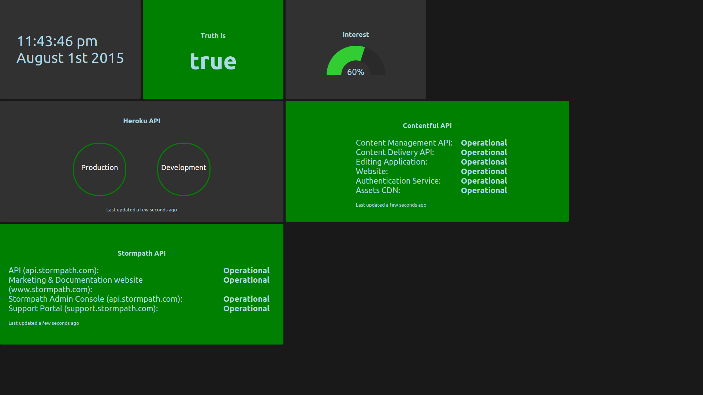

# vudash
A dashboard like dashing, but written in node, with less bumf.



# rationale
- I'll get to the point. I like dashing, but I don't like ruby.
- Dashing-js is a stellar effort, but largely abandoned.
- Jade is an abomination.
- Coffeescript is an uneccessary abstraction.
- dashing-js has more bugs than code

# project status
It's a prototype, an alpha. Treat it as such. It does work predictably though.

# features
- es6 (for multiline strings, mostly!)
- all cross-origin requests done server side
- websockets rather than polling
- websocket fallback to long-poll when sockets aren't available
- Custom widgets
- Custom dashboards
- Simple flow layout
- Dashboard arrangement is simply the config order (see below)
- Transitioning background colour for widgets
- Extending existing widgets (soon!)

# prerequisites
- You need a moderately recent version of node.
- It is transpiled by babel automatically for es6 support.
- you need a browser which can use websockets, and supports modern html, css and javascript.

# running
```
npm run watch // development, reloading
node app.js // production
```

You can visit your dashboards at http://localhost:8000/&lt;name&gt;.dash where &lt;name&gt; is your dashboard name (in this example, 'dash.dash')

# testing
There aren't any, it's a prototype. I don't know what I want it to do yet.

# configuring
- Widgets go in widgets/
- Dashboards go in dashboards/

- Widgets emit their data using ```emit({foo: 'bar'});```
- Widget html uses blocks.js

All dashboard/widget syntax is validated using Joi, so you'll know if you mess it up.

# define a widget

```js
var moment = require('moment');

module.exports = {
  dimensions: {
    height: 25, // percent
    width: 25 // percent
  },
  template: {
    html: `
     <div class="test">
      {{time}}
     </div>
    `, // the widget's htm, sits inside a .grid-item div.
    css: `.test { font-size: 30px; }`, // css specific to the widget, careful not to conflict
    model: { // blocks.js view model
      time: new Date() // property binding, and initial value
    }
  },
  job: {
    schedule: 1000, // How many ms should we run the update job
    script: function(emit) { // update job
      emit({time: moment().format('MMMM Do YYYY, h:mm:ss a').toString()});
      // we 'emit' a key/value map which is bound to the view model (above)
    }
  }
}
```

# define a dashboard
```js
[{
  "widget": "time" // time is the name of the widget above
}] // array of config objects which currently can only name a widget.
```

# roadmap
- Extending existing widgets/dashboards
- More widgets
- Flashy widgets for warnings

# contributions
- Send me a PR. I love them.

# license
MIT
